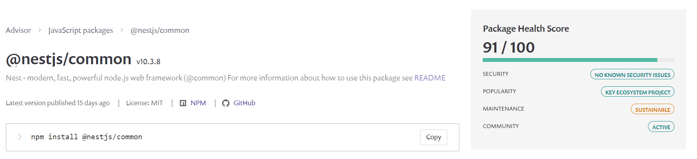

Source: [https://snyk.io/](https://snyk.io/)

### NestJs

We are using the last version 10.3.8.

### Typeorm

Typeorm is the default ORM used in NestJs and we decided to use in our project.

The last vulnerabilities found were in 2018, version 0.1.21, and since that no more vulnerabilities were found.

We are using the version 0.3.20

### Bcrypt

 Password encryption recommended by Nest docs [https://docs.nestjs.com/security/encryption-and-hashing](https://docs.nestjs.com/security/encryption-and-hashing)

This package has 3 identified vulnerabilities on old versions but no more issues since version 5.0.1.
Currently, it is in version 5.1.1

### Class-validator

We are using this plugin to validate our dtos.

The last vulnerability found was in 11/2021 and we are using the version 0.14.1

We are using other plugins like Prettier, Typescript, and ESlint, but those all are part of NestJs architecture and their analysis is included in the framework analysis in the Snyk.

### Passport 

We are using this library to make the JWT authentication and the guards for secure the routes allowing the access only for authenticated users.

No vulnerabilities were found.

